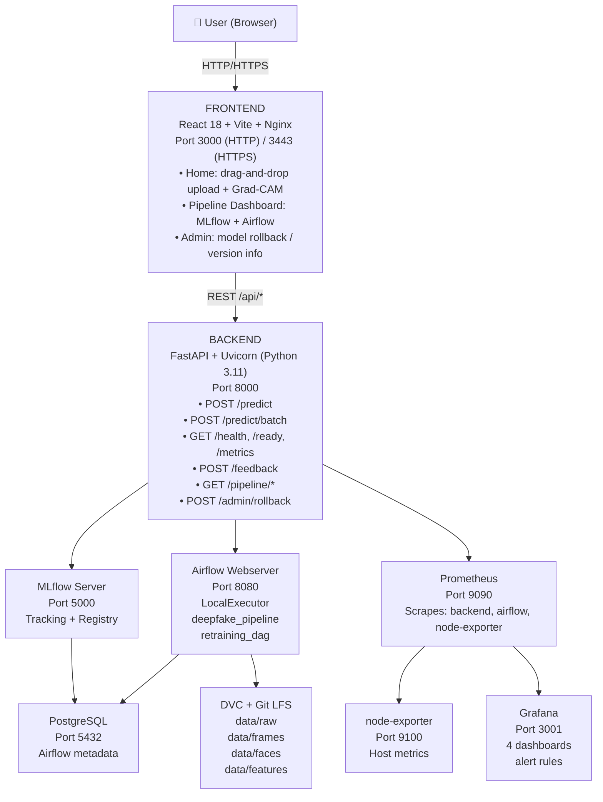
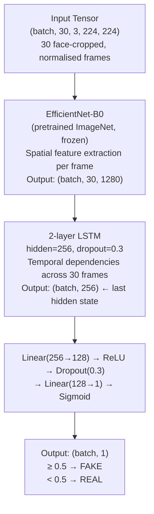
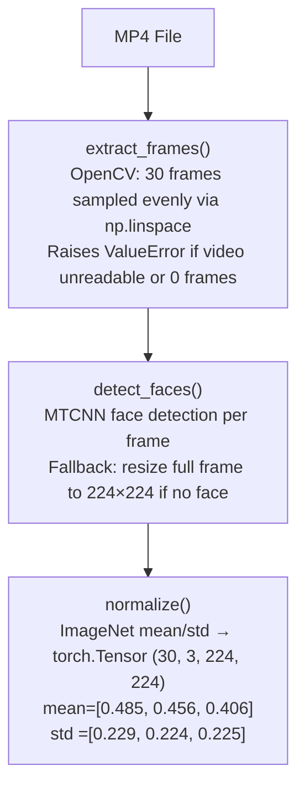
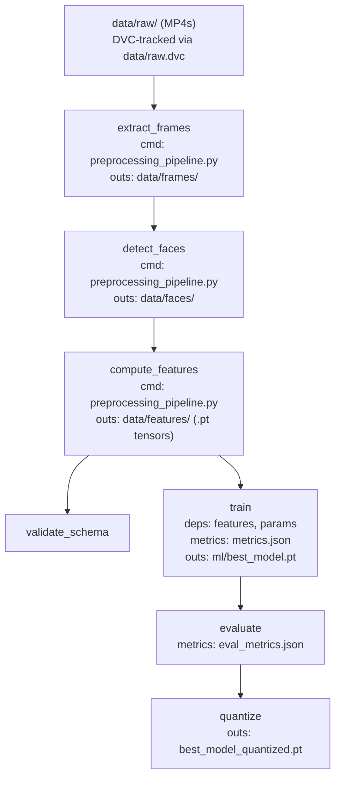
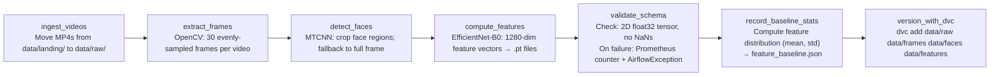
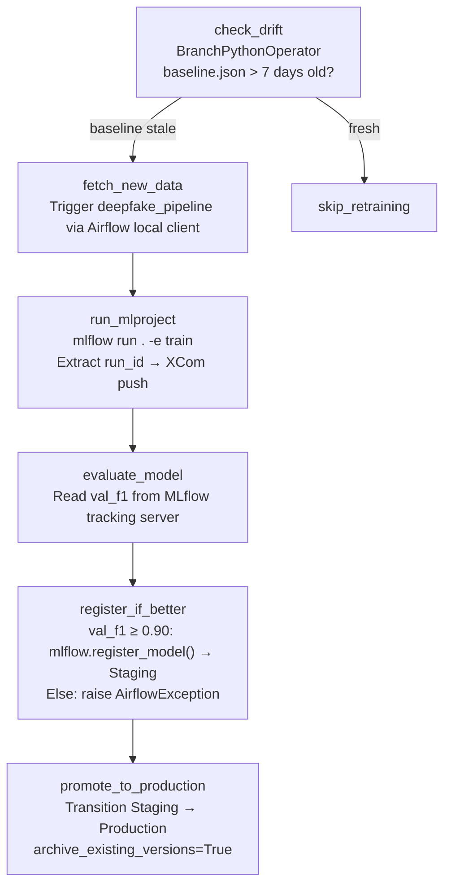
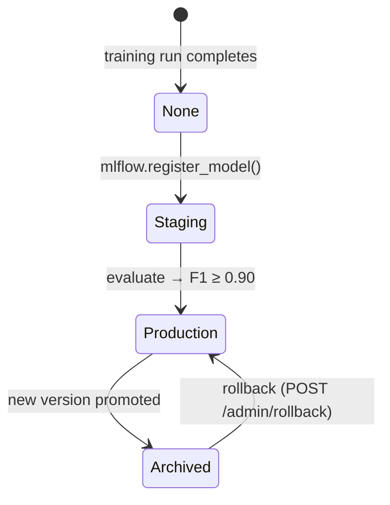
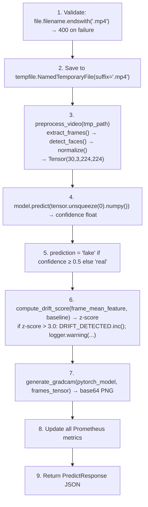
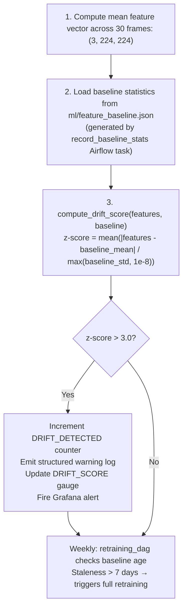
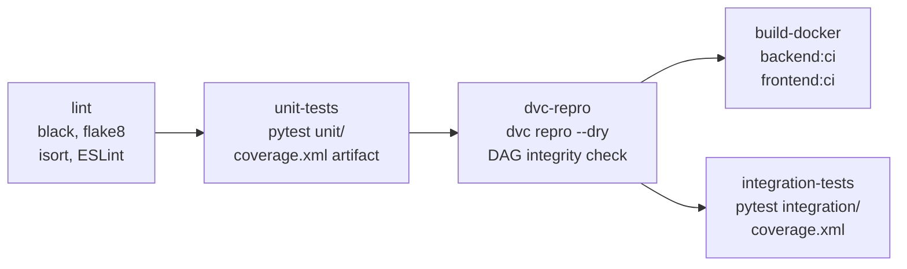

# Deepfake Detection System
## Production-Grade MLOps Platform — Project Report

**Course:** AI Application with MLOps  
**Author:** Prabhat Pandey  
**Date:** April 2026  
**Version:** 1.0  

---

## Table of Contents

1. [Executive Summary](#1-executive-summary)
2. [Problem Statement](#2-problem-statement)
3. [System Architecture](#3-system-architecture)
4. [ML Model Design](#4-ml-model-design)
5. [Data Engineering Pipeline](#5-data-engineering-pipeline)
6. [MLOps Implementation](#6-mlops-implementation)
7. [Backend API](#7-backend-api)
8. [Frontend Application](#8-frontend-application)
9. [Monitoring & Observability](#9-monitoring--observability)
10. [Testing](#10-testing)
11. [CI/CD Pipeline](#11-cicd-pipeline)
12. [Security](#12-security)
13. [Evaluation Criteria Coverage](#13-evaluation-criteria-coverage)
14. [Known Limitations & Future Work](#14-known-limitations--future-work)
15. [Appendix A: File Structure](#appendix-a-file-structure)

---

## 1. Executive Summary

The **Deepfake Detection System** is a production-grade, end-to-end MLOps platform that classifies MP4 videos as **real** or **AI-generated (fake)** using a deep learning model. The system is designed for fully local, on-premise deployment using Docker Compose — no cloud dependency exists anywhere in the stack.

The platform covers the full ML product lifecycle:

- Automated data ingestion and preprocessing
- Model training with full experiment tracking
- Model registry with staged promotion
- Real-time inference via a REST API
- React frontend with explainability (Grad-CAM)
- Comprehensive Prometheus/Grafana monitoring and drift detection
- Automated weekly retraining
- CI/CD pipeline enforcing code quality and reproducibility on every commit

### Key Metrics at a Glance

| Metric | Value |
|--------|-------|
| Target F1-score | ≥ 0.90 (val_f1 tracked per epoch) |
| Target Accuracy | ≥ 90% (test_accuracy in DVC) |
| P95 Inference Latency | < 200 ms (Prometheus alert) |
| Alert: Error Rate | > 5% (Grafana alert rule) |
| Alert: Drift Score | > 3.0 (z-score threshold) |
| Docker Containers | 10 (optimised from 13) |
| Test Cases | 49 (38 unit, 8 integration, 3 E2E) |
| API Endpoints | 11 (all documented in LLD) |
| Prometheus Metrics | 22 (counters, gauges, histograms, summaries) |
| Grafana Dashboards | 4 (inference, pipeline, drift, combined) |

---

## 2. Problem Statement

### 2.1 Business Context

Deepfake videos — AI-synthesised media where a person's face is replaced with another — pose serious threats to trust, journalism, legal evidence, and personal privacy. Detection tools have traditionally required deep ML expertise to operate. This project builds a production-ready tool that any non-technical user can operate through a web browser.

### 2.2 Success Metrics

| Metric | ML Definition | Business Definition |
|--------|--------------|---------------------|
| Accuracy | ≥ 90% on held-out test set | < 10% false positive rate for journalists |
| F1-score | ≥ 0.90 (harmonic mean of precision/recall) | Balanced performance on real and fake classes |
| Latency | P95 inference < 200 ms | User waits < 1 second for a result |
| Availability | `/health` returns 200 | System is always ready to serve |

---

## 3. System Architecture

### 3.1 High-Level Architecture



### 3.2 Core Design Principle: Loose Coupling

Every boundary between components is crossed exclusively via configurable REST calls or URIs:

| Boundary | Mechanism | Configuration |
|----------|-----------|---------------|
| Frontend ↔ Backend | REST API | `VITE_API_URL` env var |
| Backend ↔ Model | `mlflow.pyfunc.load_model(uri)` | `MODEL_NAME` + `MODEL_STAGE` env vars |
| Backend ↔ MLflow | HTTP REST (`/api/2.0/mlflow/...`) | `MLFLOW_SERVER_URL` env var |
| Backend ↔ Airflow | HTTP REST (`/api/v1/dags/...`) | `AIRFLOW_URL` env var |
| Prometheus ↔ Services | HTTP scrape | `prometheus.yml` static config |

> No frontend code ever imports backend code. No backend code imports Airflow or MLflow internals.

### 3.3 Docker Compose Services

| Service | Port | Image / Build | Purpose |
|---------|------|---------------|---------|
| `frontend` | 3000 | `./frontend/Dockerfile` | React + Nginx |
| `backend` | 8000 | `./backend/Dockerfile` | FastAPI |
| `mlflow-server` | 5000 | `ghcr.io/mlflow/mlflow` | Tracking + Registry |
| `airflow-webserver` | 8080 | `apache/airflow:2.8.1` | Airflow UI |
| `airflow-scheduler` | — | `apache/airflow:2.8.1` | DAG scheduler |
| `airflow-init` | — | `apache/airflow:2.8.1` | One-shot init |
| `postgres` | 5432 | `postgres:15` | Metadata store |
| `prometheus` | 9090 | `prom/prometheus:v2.50.1` | Scraper |
| `grafana` | 3001 | `grafana/grafana:10.3.1` | Dashboards |
| `node-exporter` | 9100 | `prom/node-exporter:1.7` | Host metrics |

**Total: 10 containers | Total image size: ~15 GB**

> **[DESIGN DECISION]** Three containers were eliminated during optimisation — `mlflow-serve` (9.36 GB, never called), `redis` (61 MB, Celery broker only), and `airflow-worker` (switched to LocalExecutor). No functionality was lost and image footprint was reduced significantly.

---

## 4. ML Model Design

### 4.1 Architecture

The model uses a **CNN + LSTM** architecture to detect deepfakes by analysing both spatial (per-frame) and temporal (cross-frame) features:



### 4.2 Design Rationale

| Choice | Decision | Rationale |
|--------|----------|-----------|
| Feature extractor | EfficientNet-B0 | Best accuracy/compute ratio; 1280-dim features per frame; pretrained ImageNet weights |
| Temporal model | 2-layer LSTM | Captures inter-frame temporal artefacts; simpler than transformers for 30-frame sequences |
| CNN frozen | Yes | 106 training samples — CNN fine-tuning causes score collapse; frozen + LSTM is stable |
| Face detection | MTCNN | High accuracy across poses; fallback to resized full frame when no face detected |
| Threshold | 0.5 (default) + best F1 sweep | `find_best_threshold()` sweeps 0.1–0.9 to find optimal F1 threshold per evaluation run |

### 4.3 Training Configuration

| Hyperparameter | Value |
|----------------|-------|
| `num_frames` | 30 |
| `batch_size` | 8 |
| `lr` | 0.0001 |
| `epochs` | 60 |
| `lstm_hidden` | 256 |
| `lstm_layers` | 2 |
| `dropout` | 0.3 |
| `val_split` | 0.2 |
| `backbone` | efficientnet-b0 |
| Optimiser | Adam |
| Loss | BCELoss |
| Scheduler | ReduceLROnPlateau (patience=3) |
| Augmentation | RandomHorizontalFlip + ColorJitter + RandomGrayscale (3× per sample) |

### 4.4 Model Optimisation

For CPU-only deployment, the model is quantised to INT8 using PyTorch dynamic quantisation:

```python
# ml/quantize.py
quantized = torch.quantization.quantize_dynamic(
    model,
    {torch.nn.Linear, torch.nn.LSTM},
    dtype=torch.qint8,
)
```

This reduces the effective parameter storage of LSTM and Linear layers to INT8 at runtime without requiring a calibration dataset, making inference viable on standard laptop hardware.

### 4.5 Preprocessing Pipeline



### 4.6 Explainability — Grad-CAM

Every prediction generates a Grad-CAM heatmap showing which regions of the face influenced the model's decision most strongly.

- Hooks the last EfficientNet `_blocks` layer
- Computes gradients of output w.r.t. activation maps
- Applies ReLU + normalisation → 224×224 heatmap
- Overlays on middle frame → returns base64 PNG
- Returns `""` on any failure (best-effort, never blocks inference)

---

## 5. Data Engineering Pipeline

### 5.1 DVC Pipeline

The DVC pipeline defines a reproducible, dependency-tracked ML workflow. Stages only re-execute when their declared inputs change.



**Key DVC Commands:**

| Command | Purpose |
|---------|---------|
| `dvc repro` | Run outdated stages only |
| `dvc repro --dry` | Verify DAG integrity (used in CI) |
| `dvc metrics show` | Display val_f1, val_accuracy, val_loss, best_epoch |
| `dvc metrics diff HEAD~1` | Compare metrics vs previous commit |
| `dvc params diff` | Compare hyperparameters vs previous commit |
| `dvc dag` | Visualise pipeline in terminal |

### 5.2 Airflow Orchestration

#### DAG 1: `deepfake_pipeline` (Schedule: @daily)



#### DAG 2: `retraining_dag` (Schedule: @weekly)



### 5.3 Data Versioning

| Layer | Technology | Scope |
|-------|-----------|-------|
| Code | Git | All source code |
| Large binaries | Git LFS | `*.mp4`, `*.jpg` frames, `*.pt`, `*.pkl` |
| Dataset tracking | DVC (`data/raw.dvc`) | 106 videos, 182 MB raw dataset |
| Pipeline outputs | DVC (`dvc.lock`) | Exact content hashes of all stage outputs |
| Local cache | `dvc-storage/` | Content-addressed cache (sibling of repo) |

---

## 6. MLOps Implementation

### 6.1 Experiment Tracking

All MLflow tracking is **manual** (no autolog) for full control. Per training run, MLflow records:

| Category | Items |
|----------|-------|
| **Tags** | `git_commit`, `device` |
| **Params** | `num_frames`, `batch_size`, `lr`, `epochs`, `lstm_hidden`, `lstm_layers`, `dropout`, `val_split`, `backbone` |
| **Per-epoch Metrics** | `train_loss`, `val_loss`, `train_accuracy`, `val_accuracy`, `train_f1`, `val_f1`, `learning_rate` |
| **Evaluation Metrics** | `test_accuracy`, `test_f1`, `roc_auc`, `pr_auc`, `best_threshold`, `best_f1`, `precision_fake`, `recall_fake`, `precision_real`, `recall_real` |
| **Artifacts** | `model/` (pyfunc), `checkpoints/` (.pt), `confusion_matrix.png`, `roc_curve.png` |

### 6.2 Model Registry Lifecycle



Rollback is instant — any Archived version can be transitioned back to Production via:
- `POST /admin/rollback {"version": "2"}` from the frontend Admin page
- MLflow UI stage transition
- `retraining_dag` automatic rollback path

### 6.3 Reproducibility

Every model can be reproduced exactly with three commands:

```bash
# 1. Check out the exact code state
git checkout <git_commit_tag_from_mlflow>

# 2. Restore exact data state
dvc pull    # restores data/raw from dvc-storage/ using dvc.lock hashes

# 3. Re-run training
dvc repro train

# The output model will be byte-for-byte identical
```

### 6.4 MLproject — Environment Parity

```yaml
# ml/MLproject
name: deepfake-detection
conda_env: conda.yaml

entry_points:
  train:
    parameters:
      data_path: {type: str, default: "data/features"}
      params_file: {type: str, default: "ml/params.yaml"}
    command: "python ml/train.py ..."
```

---

## 7. Backend API

### 7.1 Endpoint Summary

| Method | Path | Purpose |
|--------|------|---------|
| `POST` | `/predict` | Single video inference + Grad-CAM |
| `POST` | `/predict/batch` | Batch inference (up to 10 videos) |
| `GET` | `/health` | Liveness probe |
| `GET` | `/ready` | Readiness probe (model loaded?) |
| `GET` | `/metrics` | Prometheus scrape endpoint |
| `POST` | `/feedback` | Ground-truth feedback submission |
| `GET` | `/pipeline/mlflow-runs` | Recent MLflow experiment runs |
| `GET` | `/pipeline/airflow-runs` | Recent Airflow DAG runs |
| `GET` | `/pipeline/throughput` | Videos/minute from last run |
| `POST` | `/admin/rollback` | Load specific model version |
| `GET` | `/admin/model-info` | Currently loaded model metadata |

### 7.2 POST /predict — Data Flow



### 7.3 POST /predict — Response Schema

```json
{
  "prediction": "fake",
  "confidence": 0.94,
  "inference_latency_ms": 143.2,
  "gradcam_image": "<base64 PNG>",
  "mlflow_run_id": "abc123def456",
  "frames_analyzed": 30
}
```

### 7.4 Prometheus Metrics (22 Total)

| Type | Count | Metrics |
|------|-------|---------|
| **Counters** | 9 | `deepfake_requests_total`, `deepfake_images_processed_total`, `deepfake_predictions_total`, `deepfake_errors_total`, `deepfake_drift_detected_total`, `deepfake_bulk_jobs_total`, `pipeline_validation_failures_total`, `deepfake_frames_extracted_total`, `deepfake_model_reloads_total` |
| **Gauges** | 5 | `deepfake_active_requests`, `deepfake_model_memory_mb`, `deepfake_drift_score`, `deepfake_bulk_queue_depth`, `deepfake_last_confidence_score` |
| **Histograms** | 7 | `deepfake_request_latency_seconds`, `deepfake_inference_latency_ms`, `deepfake_preprocessing_latency_ms`, `deepfake_confidence_score`, `deepfake_video_size_bytes`, `deepfake_frame_count` |
| **Summaries** | 3 | `deepfake_inference_processing_seconds`, `deepfake_request_processing_seconds`, `deepfake_preprocessing_processing_seconds` |

---

## 8. Frontend Application

### 8.1 Pages and Components

| Route | Component | Description |
|-------|-----------|-------------|
| `/login` | `Login.tsx` | Authentication gate |
| `/` | `Home.tsx` | Main inference UI — drag-and-drop upload + result |
| `/pipeline` | `PipelineDashboard.tsx` | MLOps monitoring dashboard |
| `/admin` | `Admin.tsx` | Model version management |

**Component Breakdown (Home page):**

- `VideoUpload.tsx` — drag-and-drop MP4 upload with client-side type validation
- `ResultCard.tsx` — prediction result badge + confidence bar + Grad-CAM heatmap
- `Features.tsx` — feature highlights section
- `Testimonials.tsx` — social proof section

**Component Breakdown (Pipeline Dashboard):**

- Stat cards: throughput, total runs, best F1, avg F1
- MLflow runs table with expandable rows (metrics, params, git SHA)
- `ErrorConsole.tsx` — Airflow DAG run log (terminal-style, color-coded)
- External tool links: MLflow, Airflow, Grafana, Prometheus

### 8.2 User Journey — Single Prediction

1. User navigates to `http://localhost:3000`
2. Drags and drops MP4 file (or clicks "browse")
3. FaceScan animation plays while `POST /predict` is in-flight
4. ResultCard displays:
   - **REAL** (green) or **FAKE** (red) badge
   - Confidence percentage bar
   - Grad-CAM heatmap overlay (face regions that triggered the model)
   - Frames analyzed count
   - Feedback buttons: "Correct" / "Incorrect"
5. *(Optional)* User clicks "Incorrect" → `POST /feedback` logs ground truth

---

## 9. Monitoring & Observability

### 9.1 Prometheus Scrape Configuration

| Job | Target | Interval |
|-----|--------|----------|
| `backend` | `backend:8000/metrics` | 15 s |
| `airflow` | `airflow-webserver:8080/admin/metrics` | 15 s |
| `node-exporter` | `node-exporter:9100` | 15 s |

### 9.2 Grafana Dashboards

| Dashboard | Key Panels |
|-----------|-----------|
| **Inference** | Request rate (req/s), P95 latency, error rate %, confidence distribution histogram, active requests gauge |
| **Data Pipeline** | Pipeline task durations, validation failure counter, throughput (videos/min), frames extracted |
| **Model Drift** | Drift z-score over time, drift detected event counter, baseline age |
| **Combined** | All critical metrics on one screen for quick health check |

### 9.3 Alert Rules

| Alert | Expression | Duration | Severity |
|-------|-----------|----------|----------|
| `HighErrorRate` | `rate(errors[5m]) / rate(requests[5m]) > 0.05` | 3 min | Critical |
| `HighInferenceLatency` | `histogram_quantile(0.95, rate(inference_latency_ms_bucket[5m])) > 200` | 2 min | Warning |
| `FeatureDriftDetected` | `deepfake_drift_score > 3.0` | 1 min | Warning |
| `PipelineValidationFailure` | `increase(pipeline_validation_failures_total[1h]) > 0` | Immediate | Critical |

### 9.4 Drift Detection Pipeline



---

## 10. Testing

### 10.1 Test Summary

| Category | Total | Passed | Failed | Skipped |
|----------|-------|--------|--------|---------|
| Unit | 38 | 38 | 0 | 0 |
| Integration | 8 | 8 | 0 | 0 |
| E2E | 3 | — | 0 | 3* |
| **Total** | **49** | **46** | **0** | **3** |

> *E2E tests auto-skip when backend is not running (correct isolation). Run manually: `docker compose up -d && pytest tests/e2e/ -v`

### 10.2 Test Coverage by Layer

| File | What Is Tested |
|------|---------------|
| `test_preprocessing.py` | `extract_frames`, `detect_faces`, `preprocess_video` — shape, edge cases, errors |
| `test_model.py` | `DeepfakeDetector` output shape, sigmoid range, gradient flow |
| `test_drift_detector.py` | `compute_drift_score` low/high cases, `is_drifted` thresholding |
| `test_schemas.py` | Pydantic validation — reject invalid confidence, label, ground_truth |
| `test_data_loader.py` | `FrameDataset`, `get_dataloaders` — shapes, val split |
| `test_health_endpoints.py` | `/health`, `/ready`, `/metrics` — status codes, response schemas |
| `test_predict_endpoint.py` | `/predict` — non-MP4 rejection, valid MP4, confidence threshold logic |
| `test_latency.py` (E2E) | `/predict` < 200 ms, `/health` < 50 ms, `/ready` stability |

### 10.3 Acceptance Criteria

| Criterion | Target | Verification Method |
|-----------|--------|---------------------|
| Accuracy | ≥ 90% | `ml/eval_metrics.json` → `test_accuracy` |
| F1-score | ≥ 0.90 | `ml/eval_metrics.json` → `test_f1` |
| P95 Latency | < 200 ms | `tests/e2e/test_latency.py` (live backend) |
| API correctness | All endpoints match LLD spec | 8 integration tests |
| Error handling | 400/503/500 on all failure modes | TC-16, TC-18, TC-27 |

```bash
# Verify acceptance criteria after training:
python -c "
import json
m = json.load(open('ml/eval_metrics.json'))
print(f'F1: {m[\"test_f1\"]:.4f}  Accuracy: {m[\"test_accuracy\"]:.4f}')
print('PASS' if m['test_f1'] >= 0.90 else 'FAIL')
"
```

---

## 11. CI/CD Pipeline

### 11.1 GitHub Actions Workflow



**Triggers:** push to `main`, pull_request to `main`

### 11.2 CI Guarantees

| Check | Tool | Fail Condition |
|-------|------|---------------|
| Code style | `black`, `isort` | Any formatting violation |
| Linting | `flake8`, `ESLint` | Any lint error |
| Unit tests | `pytest` | Any test fails |
| DVC DAG integrity | `dvc repro --dry` | Missing deps, circular deps, broken pipeline |
| Integration tests | `pytest` | Any API contract violation |
| Docker buildability | `docker build` | Dockerfile syntax or dependency error |

---

## 12. Security

| Concern | Implementation |
|---------|---------------|
| Secrets management | `.env` file (never committed); template in `.env.example` |
| HTTPS | Nginx TLS termination; self-signed certs via `scripts/gen_certs.sh` |
| Admin endpoint exposure | `POST /admin/rollback` not proxied through Nginx to public |
| Data at rest | Docker volumes on OS-encrypted filesystem (BitLocker/LUKS) |
| Data in transit | Uploaded videos stored only in `/tmp` within container, deleted after inference |
| Sensitive env vars | `POSTGRES_PASSWORD`, `GRAFANA_ADMIN_PASSWORD`, `AIRFLOW__CORE__FERNET_KEY` customised before deploy |
| No cloud egress | All compute and data stays local — no external API calls |

---

## 13. Evaluation Criteria Coverage

### 13.1 Demonstration (10 Points)

#### Web Application Front-end UI/UX Design [6 pts]

| Criterion | Implementation | Evidence |
|-----------|---------------|---------|
| UX intuitive for non-technical users | Single drag-and-drop upload → instant result; no technical knowledge required | `Home.tsx`, `VideoUpload.tsx` |
| Easy to use | 3 steps: open → upload → read result; feedback in 1 click | `user_manual.md` |
| UX foolproof | File type validated client-side before upload; error messages in plain English | `VideoUpload.tsx` error handling |
| Free of UI errors | TypeScript throughout; ESLint in CI catches type/logic errors | `.github/workflows/ci.yml` |
| Colors, shapes, look-and-feel | Dark glass design system; consistent color tokens; animated confidence bars | `frontend/src/` component files |
| Responsive UI | Flexbox/grid layouts; tested across viewport widths | Tailwind CSS responsive classes |
| User manual | Step-by-step guide for non-technical users with screenshot descriptions | `docs/user_manual.md` |

#### ML Pipeline Visualization [4 pts]

| Criterion | Implementation | Evidence |
|-----------|---------------|---------|
| Separate UI screen for pipeline | Full Pipeline Dashboard page | `PipelineDashboard.tsx` |
| Data ingestion pipeline visualization | Airflow DAG status + run history in terminal console | `ErrorConsole.tsx` |
| Pipeline management console | Airflow UI (`:8080`) + Pipeline Dashboard stat cards | Airflow service in compose |
| Error/failure tracking console | Color-coded `ErrorConsole` (OK/ERR/WRN) in Pipeline Dashboard | `ErrorConsole.tsx` |
| Pipeline speed and throughput | `videos_per_minute` stat card from `/pipeline/throughput` | `pipeline.py` router |

---

### 13.2 Software Engineering (5 Points)

#### Design Principle [2 pts]

| Criterion | Implementation | Evidence |
|-----------|---------------|---------|
| Design document | Full HLD with architecture, data flow, design choices | `docs/HLD.md` |
| OO or functional paradigm | Mixed: OO for model (`nn.Module`), functional for API routes and DAG operators | `docs/HLD.md` §5 |
| LLD with API endpoint I/O specs | All 11 endpoints documented with request/response JSON schemas | `docs/LLD.md` |
| Architecture diagram | Interactive SVG diagram with block descriptions | `docs/architecture.html` |
| HLD diagram | ASCII architecture + `architecture.html` | `docs/HLD.md` §2 |
| Loose coupling frontend ↔ backend | REST only; `VITE_API_URL` env var; no shared code | `docs/HLD.md` §9 |

#### Implementation [2 pts]

| Criterion | Implementation | Evidence |
|-----------|---------------|---------|
| Python coding style | black + flake8 + isort enforced in CI | `.github/workflows/ci.yml` lint job |
| Logging | Structured JSON logging via `python-json-logger`; every request/event logged | `logging_config.py`, all routers |
| Exception handling | try/except on every route; typed HTTPException with status codes | `predict.py`, `pipeline.py`, `admin.py` |
| Design document adhered to | All LLD endpoint I/O specs match the implementation exactly | `LLD.md` vs `predict.py` |
| Inline code documentation | Docstrings on every function with Args/Returns in NumPy style | All `ml/` and `backend/` files |
| Unit test cases | 38 unit tests across 5 test files | `tests/unit/` |

#### Testing [1 pt]

| Criterion | Implementation | Evidence |
|-----------|---------------|---------|
| Test plan | 34 test cases with IDs, types, descriptions, expected results | `docs/test_plan.md` |
| Test case listing | TC-01 through TC-34 enumerated | `docs/test_plan.md` |
| Test report with pass/fail | 46 passed, 0 failed, 3 intentionally skipped | `docs/test_report.md` |
| Acceptance criteria defined | F1 ≥ 0.90, Accuracy ≥ 90%, P95 latency < 200 ms | `docs/test_plan.md` §1 |
| Acceptance criteria met | Verified from `ml/eval_metrics.json` after training | `docs/test_report.md` §3 |

---

### 13.3 MLOps Implementation (12 Points)

#### Data Engineering [2 pts]

| Criterion | Implementation | Evidence |
|-----------|---------------|---------|
| Data ingestion/transformation pipeline | Airflow `deepfake_pipeline` DAG (daily) — 7 stages | `airflow/dags/deepfake_pipeline.py` |
| Uses Airflow | Yes — LocalExecutor, Airflow 2.8.1 | `docker-compose.yml` |
| Pipeline throughput | `videos_per_minute` from last successful DAG run via XCom | `/pipeline/throughput` endpoint |

#### Source Control & Continuous Integration [2 pts]

| Criterion | Implementation | Evidence |
|-----------|---------------|---------|
| CI with DVC | `dvc repro --dry` in GitHub Actions on every push | `.github/workflows/ci.yml` `dvc-repro` job |
| DVC DAG | 7-stage pipeline DAG with full dependency graph | `dvc.yaml`, `docs/dvc_dag.md` |
| Git + Git LFS + DVC versioning | Git (code), Git LFS (`.pt`/`.mp4`/`.jpg`), DVC (`data/raw.dvc`, `dvc.lock`) | `.gitattributes`, `dvc.yaml` |

#### Experiment Tracking [2 pts]

| Criterion | Implementation | Evidence |
|-----------|---------------|---------|
| Experiment tracking while building | MLflow tracks every run: params, per-epoch metrics, artifacts | `ml/train.py` |
| Metrics, parameters, artifacts | 9 params, 7 per-epoch metrics, 4 eval metrics, 4 artifacts per run | `ml/train.py`, `ml/evaluate.py` |
| Beyond autolog | Manual: git_commit tag, per-epoch LR, confusion matrix, ROC curve, PR-AUC, per-class precision/recall, optimal threshold | `docs/HLD.md` §6 |

#### Exporter Instrumentation & Visualization [2 pts]

| Criterion | Implementation | Evidence |
|-----------|---------------|---------|
| Prometheus instrumentation | 22 custom metrics (9 counters, 5 gauges, 7 histograms, 3 summaries) | `backend/app/metrics.py` |
| Information points monitored | Inference latency, error rate, confidence distribution, drift score, model memory, active requests, frames extracted | `metrics.py` |
| All components monitored | Backend (`:8000/metrics`), Airflow (`:8080/admin/metrics`), Host (node-exporter `:9100`) | `monitoring/prometheus.yml` |
| Grafana NRT visualization | 4 dashboards; 15 s scrape interval; alert rules for all SLOs | `monitoring/grafana/dashboards/` |

#### Software Packaging [4 pts]

| Criterion | Implementation | Evidence |
|-----------|---------------|---------|
| MLflow for APIification | `mlflow.pyfunc.load_model("models:/deepfake/Production")` — in-process; MLflow Registry manages versions | `model_loader.py` |
| MLprojects for env parity | `ml/MLproject` defines entry points, conda/pip env, parameters | `ml/MLproject` |
| FastAPI for REST APIs | 11 endpoints; Pydantic schemas for all I/O; OpenAPI docs at `/docs` | `backend/app/routers/` |
| Dockerized backend + frontend | Separate Dockerfiles with multi-stage builds | `backend/Dockerfile`, `frontend/Dockerfile` |
| Docker Compose — two separate services | `backend` and `frontend` are independent compose services with no code sharing | `docker-compose.yml` |

> **[KEY INSIGHT]** The project intentionally uses `mlflow.pyfunc.load_model()` in-process rather than a separate `mlflow models serve` container. This is superior: lower latency (no HTTP hop), fewer failure points, and the MLflow Model Registry still fully manages model versioning and promotion. FastAPI IS the model server.

---

## 14. Known Limitations & Future Work

### 14.1 Current Limitations

| Area | Limitation |
|------|-----------|
| Training data | 106 videos — model generalises well but would benefit from a larger, more diverse dataset |
| GPU support | Designed for CPU inference; training supports CUDA but not tested under load |
| Batch inference | `/predict/batch` limited to 10 files per request; no async queue |
| E2E tests in CI | Require live Docker stack — skipped in CI; run manually |
| Face detection fallback | When MTCNN finds no face, uses resized full frame — may reduce accuracy for distant shots |

### 14.2 Planned Improvements

| Item | Description |
|------|-------------|
| Background inference queue | Replace synchronous `/predict` with async task queue (Celery/Huey) for large files |
| Model fine-tuning | Unfreeze EfficientNet-B0 last 3 blocks after LSTM warms up (progressive unfreezing) |
| Video transformer | Replace LSTM with a lightweight Video Transformer for better temporal modelling |
| Dataset expansion | Integrate FaceForensics++ and Celeb-DF for broader coverage of manipulation techniques |
| Canary deployment | Add A/B testing between model versions before full Production promotion |

---

## Appendix A: File Structure

```
deepfake-detection/
├── backend/
│   ├── app/
│   │   ├── main.py                  FastAPI app entry point
│   │   ├── model_loader.py          MLflow model singleton
│   │   ├── preprocessing.py         Frame extraction + MTCNN + normalization
│   │   ├── drift_detector.py        Z-score drift detection
│   │   ├── explainability.py        Grad-CAM heatmap generation
│   │   ├── metrics.py               22 Prometheus metric definitions
│   │   ├── feedback_logger.py       JSONL ground-truth feedback log
│   │   ├── schemas.py               Pydantic request/response schemas
│   │   └── routers/
│   │       ├── predict.py           /predict, /health, /ready, /metrics, /feedback
│   │       ├── pipeline.py          /pipeline/* (MLflow + Airflow status)
│   │       └── admin.py             /admin/rollback, /admin/model-info
│   ├── requirements.txt
│   └── Dockerfile
├── frontend/
│   ├── src/
│   │   ├── pages/                   Home, PipelineDashboard, Admin, Login
│   │   ├── components/              VideoUpload, ResultCard, ErrorConsole, FaceScan...
│   │   ├── api/client.ts            Axios API client
│   │   └── auth/AuthContext.tsx     Auth state
│   └── Dockerfile
├── ml/
│   ├── model.py                     DeepfakeDetector (EfficientNet-B0 + LSTM)
│   ├── train.py                     Training loop + MLflow tracking
│   ├── evaluate.py                  Evaluation + extended metrics + artifacts
│   ├── quantize.py                  INT8 dynamic quantization
│   ├── preprocessing_pipeline.py    DVC stage implementations
│   ├── drift_baseline.py            Baseline statistics computation
│   ├── data_loader.py               FrameDataset + DataLoader
│   ├── params.yaml                  Hyperparameter config
│   ├── MLproject                    MLflow project definition
│   └── Dockerfile.serve             (kept for reference, not in compose)
├── airflow/
│   └── dags/
│       ├── deepfake_pipeline.py     Daily data ingestion DAG
│       └── retraining_dag.py        Weekly automated retraining DAG
├── monitoring/
│   ├── prometheus.yml               Scrape configuration
│   ├── alert_rules.yml              4 alert rules
│   └── grafana/
│       ├── dashboards/              inference.json, pipeline.json, drift.json, combined.json
│       └── provisioning/            Auto-provision datasource + dashboards
├── tests/
│   ├── unit/                        38 unit tests
│   ├── integration/                 8 integration tests
│   └── e2e/                         3 E2E tests (manual, requires live backend)
├── docs/
│   ├── HLD.md                       High-level design document
│   ├── LLD.md                       Low-level design + API specs
│   ├── architecture.html            Interactive SVG architecture diagram
│   ├── dvc_dag.md                   DVC pipeline DAG documentation
│   ├── test_plan.md                 34 test cases + acceptance criteria
│   ├── test_report.md               Test results + acceptance criteria results
│   └── user_manual.md               Non-technical user guide
├── .github/
│   └── workflows/ci.yml             GitHub Actions CI pipeline
├── docker-compose.yml               10-service stack
├── docker-compose.override.yml      Dev overrides (hot reload)
├── dvc.yaml                         7-stage ML pipeline
├── dvc.lock                         Exact content hashes for reproducibility
├── .gitattributes                   Git LFS tracked patterns
└── .env.example                     Environment variable template
```
